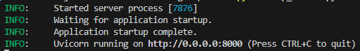

# RAG Demo with Azure MCP

This repository demonstrates a simple Retrieval-Augmented Generation (RAG) workflow using Model Context Protocol (MCP) for Azure search and Azure OpenAI for generation.

## Summary

This demo application:

1. Spins up a simple SSE-based MCP search server (`mcp_server.py`) that wraps your document index.
2. Provides a CLI client script (`demo.py`) that:
   - Connects over SSE to the MCP server
   - Sends a user query
   - Retrieves the top N matching document chunks
   - Feeds those chunks as context to Azure OpenAI
   - Prints out a grounded, concise answer (or “I don’t know.”)

---

## Getting Started

### Prerequisites

- Python 3.8+
- Azure subscription with Azure AI Search and Azure OpenAI resources
- A working Azure AI Search index (text or hybrid with integrated vectorization configured)
- Environment variables

### Setup

1. **Clone the repo**  
   ```bash
   git clone https://github.com/juichiache/mcp-rag-demo

2. **Install dependencies**
```bash
pip install -r requirements.txt

```
### Start MCP Server with environment variables loaded
#### In a new terminal, run mcp_server script

```bash
python mcp_server.py
```

#### Sample output from mcp_server.py: 


### Run RAG 

```bash
python demo.py
```

## Tech Stack Summary
1. Language & Runtime: Python 3.8+ with asyncio
2. Config: python-dotenv
3. MCP Framework: mcp.server.fastmcp + mcp.client.sse
4. Search: Azure Cognitive Search (azure-search-documents)
5. LLM: Azure OpenAI (openai SDK)
6. Transport: Server-Sent Events (SSE)
7. Utilities: logging, json, pprint

[ demo.py CLI ]
     |
     |  SSE → “search” { query, top:3 }
     ↓
[ MCP FastMCP server (mcp_server.py) ]
     |
     |  Azure Search query → get top‐N hits
     ↓
   Stream back JSONRPC “content” chunks over SSE
     |
[ demo.py assembles chunks ]
     |
     |  Azure OpenAI ChatCompletion(prompt with context)
     ↓
  Final answer printed to console


####Python & Asyncio
Runs the whole thing as async code (both the demo CLI and the SSE‐based search server). Uses asyncio for concurrency and streaming.

####Client side (demo.py)
mcp.client.sse.sse_client for opening an SSE (Server-Sent-Events) connection
mcp.client.session.ClientSession to talk the MCP “search” tool

####Server side (mcp_server.py)
mcp.server.fastmcp.FastMCP to expose an SSE endpoint and route “search” calls

####Azure AI Search
azure.search.documents.aio.SearchClient to query a search index
azure.search.documents.indexes.aio.SearchIndexClient to build or update that index
Powers the retrieval of document “chunks” (PDF pages, etc.)

####Azure OpenAI
openai.AzureOpenAI client against your Azure OpenAI deployment (GPT-4.1)
Takes the top N retrieved chunks, concatenates their "content" fields, and feeds them into a chat‐completion prompt

####Server-Sent Events (SSE)
A lightweight streaming over HTTP mechanism so the client can send a prompt and incrementally receive back search hits

####dotenv for configuration
python-dotenv to pull your Azure Search service name/key, Azure OpenAI endpoint/key, index name, etc. out of a .env file

####Standard Python tooling
- logging for debug output
- pprint / json for introspecting responses
- asyncio.run(...) to kick off the async CLI
